# LakeInsight服务实例部署文档

## 概述

LakeInsight 是开放式多模态湖仓数据智能平台，支持流、批、MPP、AI 等多种计算模式，覆盖从多源异构数据汇聚、流批一体处理分析到多模态 AI 应用的全链路场景。平台采用云原生容器化和存算分离架构，无缝对接 BI 报表与 AI 训练，在云上获得极致的弹性和性价比。

* **AI Native**：基于 VSCode 的 AI Native 一站式数据智能开发环境，提供编码、调试、部署的一体化体验。

* **Agentic AI**：辅助生成代码、工作流编排、错误排查，内置开箱即用的 MCP 和 Skills，让数据智能开发像对话一样简单。

* **结构化、非结构化数据统一存储**：构建多模态模型或向量检索应用，支持结构化数据、文本、图片、音视频等多种数据类型的统一接入、混合存储与分析处理。无需切换工具，即可完成数据清洗、特征提取与模型训练，让复杂数据像模块化积木一样自由组合。

* **数据自动化集成、流批任务开发和管理**：提供从数据接入、开发治理到数据服务和 BI 的一站式湖仓数据智能平台，支持多源及湖仓数据的交互式分析，并可自动化创建数据采集与导出任务。平台提供任务运行监控与日志解析能力，结合自然语言生成 SQL，实现从分析到发布、审批与上线的全流程闭环，提升数据处理与应用效率。

> 更多产品功能介绍与使用指南，请参见 [LakeInsight 产品文档](https://www.dmetasoul.com/docs/lakeinsight/product-intro/)。

## 计费说明

LakeInsight 支持以下两种部署模式，费用构成有所不同：

- **已有 ACK 集群**：将服务直接部署到已有集群，仅需支付软件费用。
- **新建 ACK 集群**：需先创建集群再部署服务，需支付 ACK 资源费用和软件费用。

LakeInsight 在计算巢上的费用主要涉及：

- 所选 vCPU 与内存规格
- 磁盘容量
- 公网带宽
- ACK 集群费用（仅新建集群模式）
- 软件费用

计费方式为按量付费（小时），主要为云资源费用，计算方式如下：

### CRU 定义

**CRU (Compute Resource Unit)** = max(CPU 核数, 内存 GiB / 4)

1 CRU 以 1 vCPU + 4 GiB 内存为基准；实际取值按公式取较高者——CPU 密集型场景取 CPU 核数，内存密集型场景取内存 GiB / 4。

### 资源计量

- **CPU**：`rate(container_cpu_usage_seconds_total[5m])` → 1h 平均 → cores
- **内存**：`container_memory_working_set_bytes` → 1h 平均 → GiB
- **CRU**：max(CPU_cores, Memory_GiB / 4)
- **运行分钟**：基于 Pod 生命周期（Running）统计该小时内 `runtime_minutes`
- **有效 CRU**：`effective_cru = cru × runtime_minutes / 60`

### 计费公式
```
小时费用 = effective_cru × 基础单价 × 作业类型系数
```

**示例**：
- Pod 平均用量：2 CPU + 6 GiB 内存
- CRU = max(2, 6/4) = max(2, 1.5) = 2
- 基础单价：0.5 元/CRU/小时
- 作业类型：streaming（系数 1.2）
- 若该小时运行 30 分钟：effective_cru = 2 × 30/60 = 1
- 小时费用 = 1 × 0.5 × 1.2 = 0.6 元

预估费用在创建实例时可实时看到。

## 部署架构

LakeInsight 采用云原生容器化架构，部署在阿里云 ACK（容器服务 Kubernetes 版）集群上，核心组件如下：

| 组件 | 说明 |
| --- | --- |
| LakeInsight 服务 | 核心湖仓数据智能平台，包含 Web 控制台、任务调度与查询引擎 |
| PostgreSQL | 元数据存储，支持使用内置高可用集群（CloudNative-PG，3 副本）或外接已有 PostgreSQL |
| 对象存储 | 湖仓数据持久化存储，支持使用内置存储卷或外接 S3 兼容对象存储 |
| DolphinScheduler | 分布式任务调度引擎，包含 Master 和 Worker 节点 |
| MSE Ingress | 通过阿里云微服务引擎（MSE）提供公网/内网访问入口，支持自定义域名与 HTTPS |

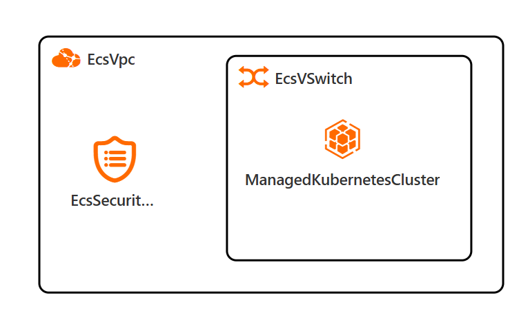

## RAM 账号所需权限

若您使用 RAM 用户创建服务实例，需提前为该账号添加以下资源访问权限。添加权限的详细操作，请参见 [为 RAM 用户授权](https://help.aliyun.com/document_detail/121945.html)。

| 权限策略名称 | 用途 | 备注 |
| --- | --- | --- |
| AliyunECSFullAccess | 创建和管理 ACK 所需的 ECS 云服务器实例 | 管理云服务器服务（ECS）的权限 |
| AliyunVPCFullAccess | 创建和管理 VPC 专有网络及交换机 | 管理专有网络（VPC）的权限 |
| AliyunROSFullAccess | 通过资源编排服务自动创建云资源栈 | 管理资源编排服务（ROS）的权限 |
| AliyunComputeNestUserFullAccess | 使用计算巢创建和管理服务实例 | 管理计算巢服务（ComputeNest）的用户侧权限 |
| AliyunCloudMonitorFullAccess | 监控集群节点和服务运行状态 | 管理云监控（CloudMonitor）的权限 |
| AliyunCSFullAccess | 创建和管理 ACK（容器服务 Kubernetes 版）集群 | 管理容器服务（CS）的权限 |
| AliyunTagAdministratorAccess | 为实例资源打标签，便于分账和管理 | 管理标签服务（TAG）和所有阿里云产品标签的权限 |
| AliyunMSEFullAccess | 通过 MSE Ingress 提供公网/内网访问入口 | 管理微服务引擎（MSE）的权限 |

## 部署流程

### 部署步骤

1. 单击部署链接，进入服务实例部署界面。您可以在阿里云计算巢自行搜索 LakeInsight，进行订阅。
2. 根据界面提示，填写参数完成部署。

### 部署参数说明

创建服务实例时，需根据实际情况配置以下参数。参数分为三种场景：已有 ACK 集群、新建 ACK 集群，以及应用级别配置（含外部存储选择）。

#### 已有 ACK 集群

选择"否"（不新建 ACK 集群）时，需提供已有集群信息：

| 参数组 | 参数项 | 示例 | 说明 |
| --- | --- | --- | --- |
| 基础信息 | 服务实例名称 | test | 实例的名称 |
| 基础信息 | 地域 | 华东1（杭州） | 选中服务实例的地域，建议就近选中，以获取更好的网络延时。 |
| 集群配置 | 是否新建 ACK 集群 | 否 | 选择否代表已有 ACK 集群，不用新建 |
| 集群配置 | K8s 集群 ID | ccde6dxxxxxxxxxxxx1230d | 根据地域选择用户已有的集群 ID |

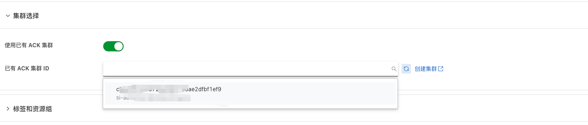

#### 新建 ACK 集群

选择"是"（新建 ACK 集群）时，需配置以下基础资源和 Kubernetes 参数：

| 参数组 | 参数项 | 示例 | 说明 |
| --- | --- | --- | --- |
| 基础信息 | 服务实例名称 | test | 实例的名称 |
| 基础信息 | 地域 | 华东1（杭州） | 选中服务实例的地域，建议就近选中，以获取更好的网络延时。 |
| 集群配置 | 是否新建 ACK 集群 | 是 | 选择是代表新建 ACK 集群 |
| 基础配置 | 可用区 | 可用区I | 地域下的不同可用区域 |
| 基础配置 | 专有网络 IPv4 网段 | 192.168.0.0/16 | VPC 的 IP 地址段范围 |
| 基础配置 | 交换机子网网段 | 192.168.1.0/24 | 必须属于 VPC 的子网段 |
| 基础配置 | 实例密码 | ******** | 设置实例密码。长度8~30个字符，必须包含三项（大写字母、小写字母、数字、()~!@#$%^&*-+={}[]:;'<>,.?/ 中的特殊符号） |
| Kubernetes 配置 | Worker 节点规格 | ecs.g6.large | 选择对应 CPU 核数和内存大小的 ECS 实例，用作 Kubernetes 节点 |
| Kubernetes 配置 | Worker 系统盘磁盘类型 | ESSD云盘 | 选择集群 Worker 节点使用的系统盘磁盘类型 |
| Kubernetes 配置 | Worker 节点系统盘大小(GB) | 120 | 设置 Worker 节点系统盘大小，单位为 GB |
| Kubernetes 配置 | Service CIDR | 172.16.0.0/16 | ACK Service 网络段，可选范围：10.0.0.0/16-24，172.16-31.0.0/16-24，192.168.0.0/16-24，不能与 VPC 及 VPC 内已有 Kubernetes 集群使用的网段重复。 |
| Kubernetes 配置 | Pod 网络 CIDR | 10.0.0.0/8 | ACK Pod 网络段，网络插件为 Flannel 时必填。请填写有效的私有网段，即以下网段及其子网：10.0.0.0/8，172.16-31.0.0/12-16，192.168.0.0/16，不能与 VPC 及 VPC 内已有 Kubernetes 集群使用的网段重复。 |

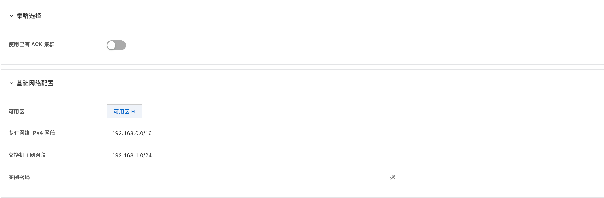
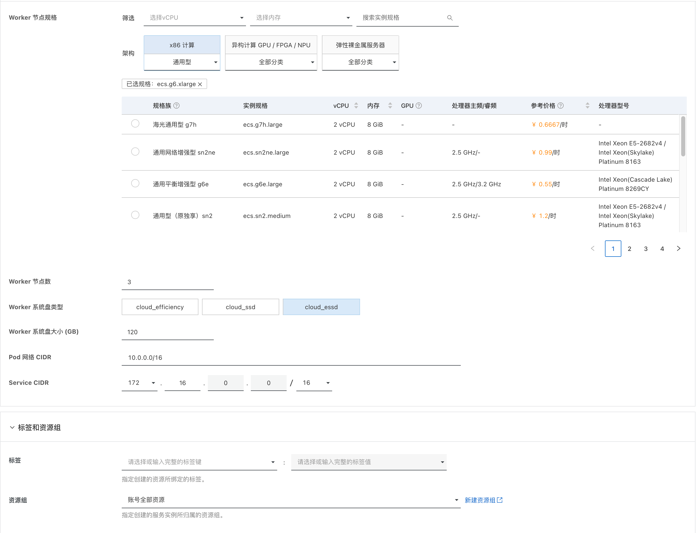

#### 应用配置

应用级别参数，包含 LakeInsight 管理员账号、网络访问、外部存储及调度组件等配置：

| 参数项 | 示例 | 说明 |
| --- | --- | --- |
| LakeInsight 管理员密码 | 123456 | 自定义首次打开LakeInsight界面的登录密码 |
| LakeInsight 管理员用户 | lakeadmin | 自定义管理员用户名，默认为 lakeadmin |
| 访问域名 | 否 | 自定义访问域名。留空则自动获取阿里云 MSE Ingress 域名，可用于测试，每天有 1000 次访问限制，请勿直接用于生产环境。|
| 启用 HTTPS | 是 | 是否启用 HTTPS 访问，启用后需配置 TLS 证书和私钥 |
| TLS 证书（PEM 格式） | 否 | TLS 证书内容（PEM 格式），启用 HTTPS 时必填 |
| TLS 私钥（PEM 格式） | 否 | TLS 私钥内容（PEM 格式），启用 HTTPS 时必填 |
| 使用外部对象存储 | 是 | 选择是代表使用已有的外部对象存储服务，需配置下方对象存储相关参数。选择否将使用内置存储 |
| 对象存储 Endpoint |  | 外部对象存储服务的访问端点 |
| 对象存储 AccessKey |  | 外部对象存储服务的 AccessKey |
| 对象存储 SecretKey |  | 外部对象存储服务的 SecretKey |
| 对象存储 Bucket |  | 外部对象存储的 Bucket 名称 |
| 对象存储 Region |  | 外部对象存储服务的 Region |
| 使用外部 PostgreSQL | 是 | 选择是代表使用已有的外部 PostgreSQL 服务，需填写下方 PostgreSQL 连接参数。选择否，系统将自动部署一个高可用 PostgreSQL 集群（3 副本，14.15 版本，默认资源规格详见下方说明） |
| PostgreSQL 服务地址 |  | 外部 PostgreSQL 服务的连接地址 |
| PostgreSQL 端口 |  | 外部 PostgreSQL 服务的端口号 |
| PostgreSQL 用户名 |  | 外部 PostgreSQL 服务的用户名 |
| PostgreSQL 密码 |  | 外部 PostgreSQL 服务的密码 |
| 是否启用数据查询服务 |  | 是否启用数据查询相关功能（需先启用 HTTPS） |
| DolphinScheduler Master 副本数 |  | DolphinScheduler Master 组件的副本数量 |
| DolphinScheduler Worker 副本数 |  | DolphinScheduler Worker 组件的副本数量 |

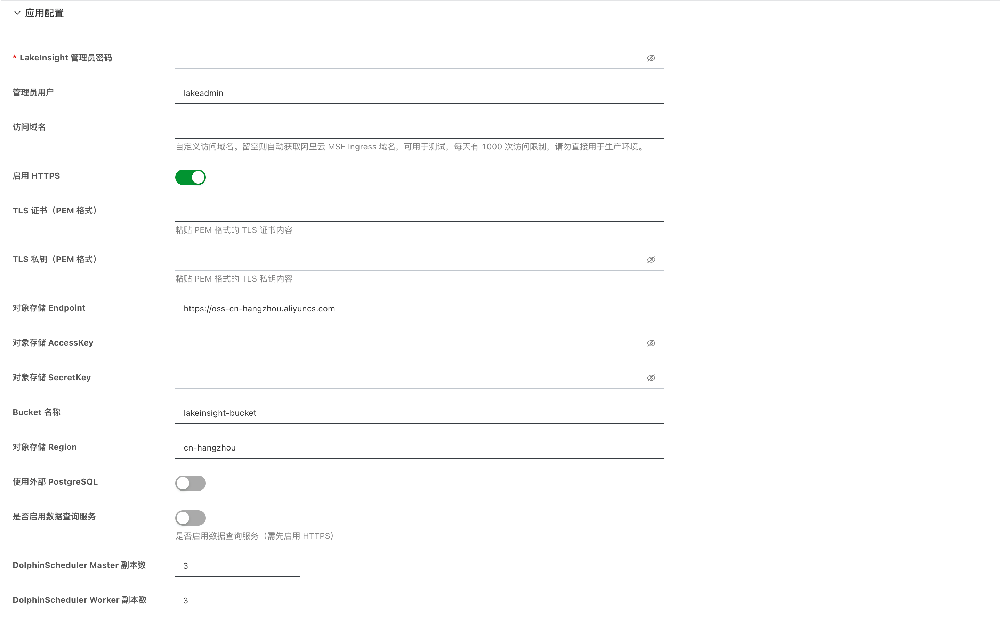

#### 不使用外部 PostgreSQL

当"使用外部 PostgreSQL"选择"否"时，系统将自动部署内置 PostgreSQL 集群，默认资源规格如下：

| 配置项 | 规格 |
| --- | --- |
| 镜像版本 | PostgreSQL 14.15（CloudNative-PG） |
| 副本数 | 3 |
| CPU（requests / limits） | 2000m / 8 核 |
| 内存（requests / limits） | 8 Gi / 32 Gi |
| 数据存储（storage） | 500 Gi，默认 StorageClass: `csi-disk-topology` |
| WAL 存储（walStorage） | 100 Gi，默认 StorageClass: `csi-disk-topology` |

#### 使用外部 PostgreSQL

当"使用外部 PostgreSQL"选择"是"时，需在上方应用配置表中填写外部 PostgreSQL 的连接信息。填写示例如下：

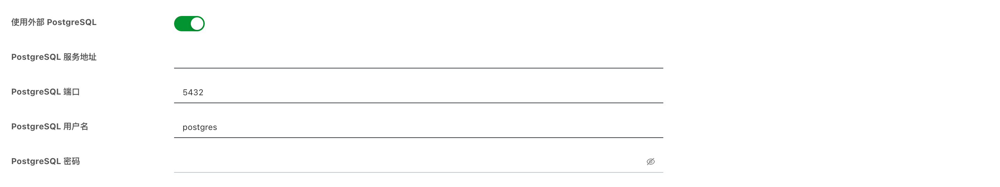

### 验证结果

部署完成后，通过以下步骤验证服务是否正常运行：

1. **查看服务实例**：在左侧导航栏进入"服务实例管理"，确认服务实例状态为"已部署"。部署过程大约需要 10 分钟。 
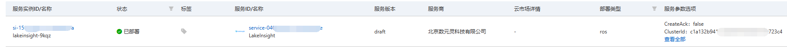

2. **获取访问信息**：点击"详情"进入服务实例详情页，可查看部署状态与基础信息。
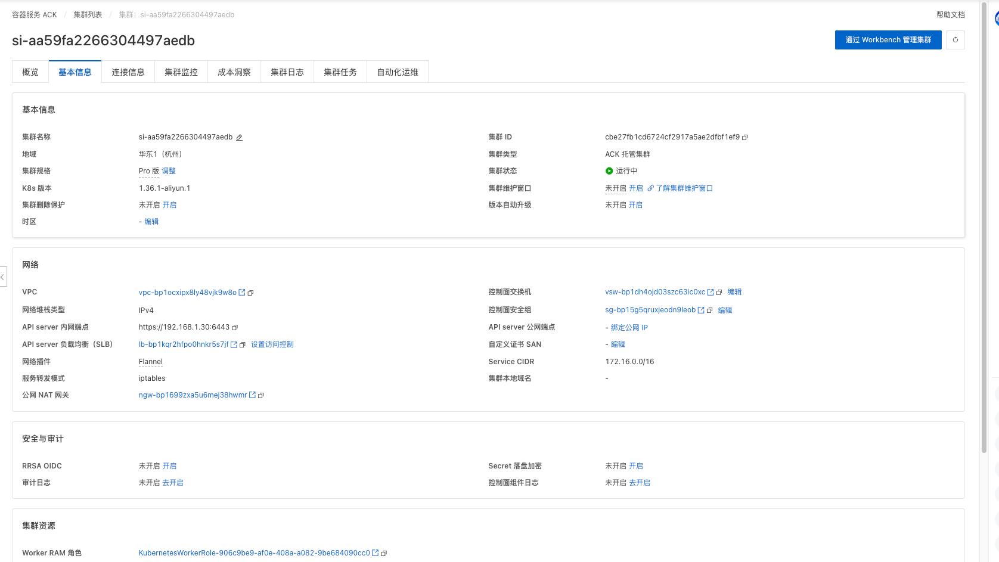

    访问域名需前往 [MSE 云原生网关控制台](https://mse.console.aliyun.com/#/microgw?region=cn-hangzhou) 查看，在网关列表中可获取访问域名、路由配置等信息。
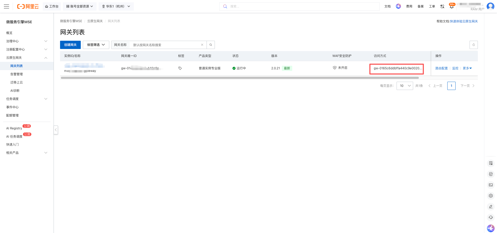

    进入 Workbench 集群管理界面，通过 `kubectl -n lakeinsight get pod` 查看各组件 Pod 状态，确认所有 Pod 状态均为 `Running`。
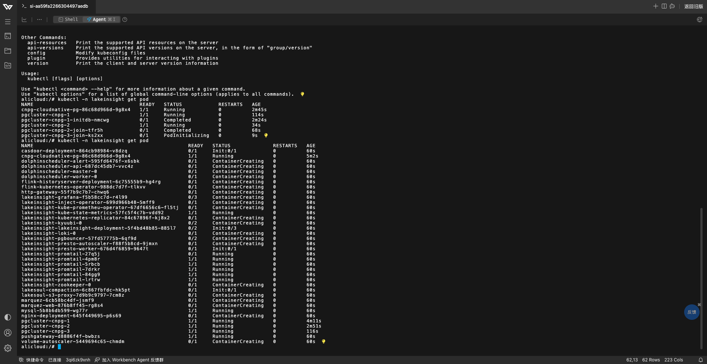

3. **访问 LakeInsight**：
    - **正式环境**：若指定了自定义域名，需将 MSE Ingress 域名解析到对应的 IP 地址后方可通过域名访问。
    - **测试环境**：可直接使用 MSE 提供的测试域名访问，在浏览器中忽略安全证书提示即可。

4. **注册用户**：首次访问 `<域名>/casdoor` 进入 Casdoor 用户中心（身份认证服务）。使用管理员账号 `admin` 和部署时设置的 **LakeInsight 管理员密码** 登录 Casdoor，进入用户管理页面创建 `lakeadmin` 用户。
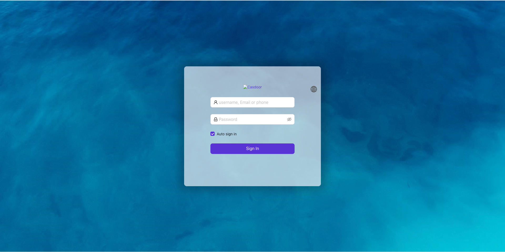

5. **登录 LakeInsight**：创建完成后，使用 `lakeadmin` 用户登录 LakeInsight 主界面（访问 `<域名>`），即可进入主页开始提交和运行任务。
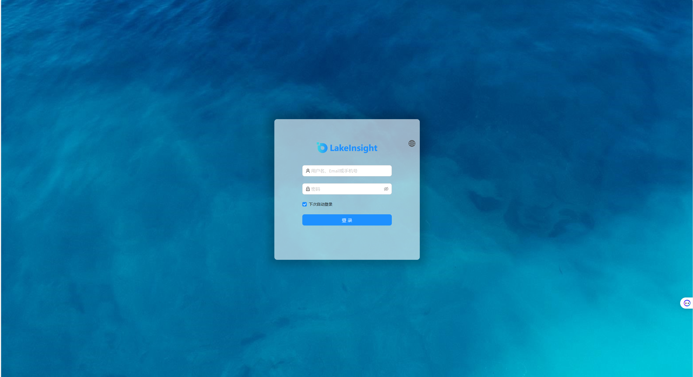
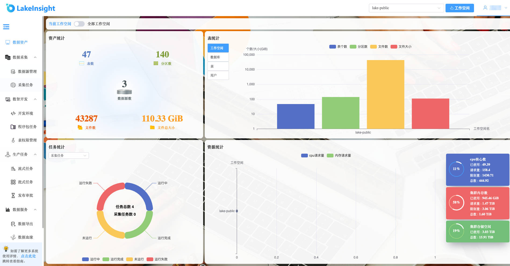

## 问题排查

请将问题反馈至[public-contact@dmetasoul.com](mailto:public-contact@dmetasoul.com)，我们将为您排查解答。

## 联系我们

欢迎访问[数元灵](https://www.dmetasoul.com)官网了解更多信息。

联系邮箱：[public-contact@dmetasoul.com](mailto:public-contact@dmetasoul.com)

社区版开源地址：[https://github.com/lakesoul-io/LakeSoul](https://github.com/lakesoul-io/LakeSoul)

扫码关注微信公众号，技术博客、活动通知不容错过：


